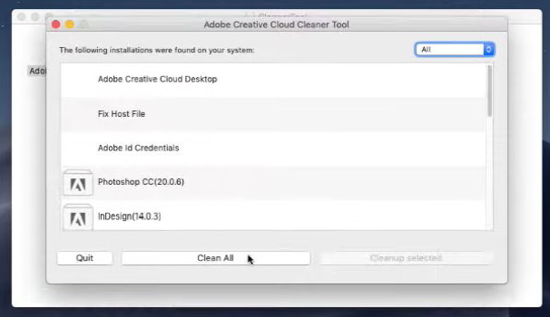

# Adobe Software installation guide

## Table of Contents

- [Adobe Software installation guide](#adobe-software-installation-guide)
  - [Table of Contents](#table-of-contents)
  - [Windows Installation](#windows-installation)
  - [macOS Installation](#macos-installation)

## Windows Installation

(for folder reefer to the JeKer Carla Gomes )
To install the Adobe Collection in Windows 10:

1. Turn off the internet connection
2. Inside Setup/ run CCMaker.exe or Setup.exe
3. Choose Install
4. Go to the directory Installer/ or Products/ and run driver.xml
5. Follow the installation process
6. Search for the newly installed program and trace back the installation folder and keep it open
7. Inside our adobe folder go to the Crack/ directory where the file "Patch" is located and copy it to the installation folder where the program is located. Make sure "Patch" replaces the initial file
8. Turn the internet back on and you should be good to go

## macOS Installation

(reference tutorial link: <https://www.youtube.com/watch?v=bBCtrGqUjs4&t=928s>)

1. Download Creative Cloud [here](https://www.zentinels.net/descargar-creative-cloud-de-prueba-sin-datos-de-pago/)
2. Download Adobe CC Cleaner Tool [here](https://www.artistapirata.com/adobe-cc-cleaner-tool-eliminar-programas-y-errores-de-adobe-cc/)
3. Sign out of Creative Cloud if you have an open session
4. Execute Adobe CC Cleaner Tool (from step 2)
   1. When the "Clean All" option appears: 
5. Go to applications and delete all thats related to Adobe
6. Go to Library->Application Support and delete Adobe/ and CEF/ folders. If there is still anything from Adobe it should also be deleted
7. Go to Library->Preferences and delete everything from Adobe (just from Adobe)
8. Run Adobe Creative Cloud (from step 1)
   1. Sign In
   2. Start installation
9. Install programs through Creative Cloud->Try option
10. Go to Artista Pirata (link [here](https://www.artistapirata.com/)) search "Zii Patcher" and download the latest version
11. Open Console
    1. Write "xattr -cr " (with the last space) and then drag the downloaded application from step 10 to the terminal. :    check if your console looks something like this and then run
12. Open the application downloaded in step 10 and patch
13. Everything should be working now
