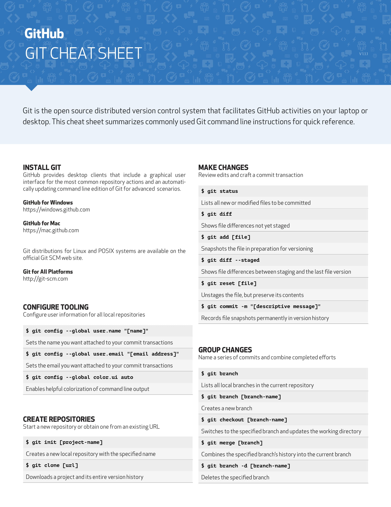
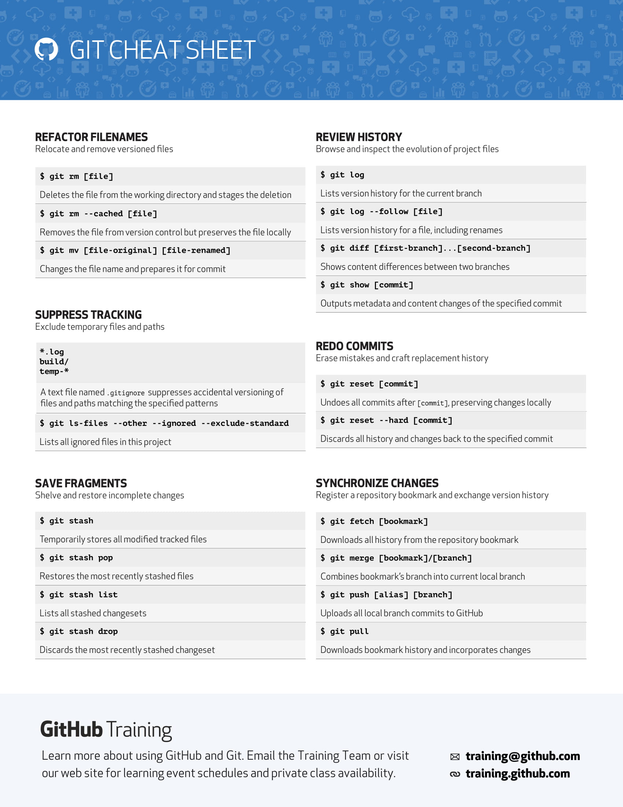

# Git Cheat Sheet



----



[Pdf File of the above](git-cheat-sheet.pdf)

## Other Important Commands

### Situation 1

If you have a development branch and a deployment branch you might want to update your deployment without some folders/files from your development branch, in that case:

``` bash
    #inside your development branch
    git checkout <deployment>
    git merge --no-commit --no-ff master
    git reset HEAD -- <file1> <folder>
    git clean -fd
    git commit -m "<message>"
    git push
```
